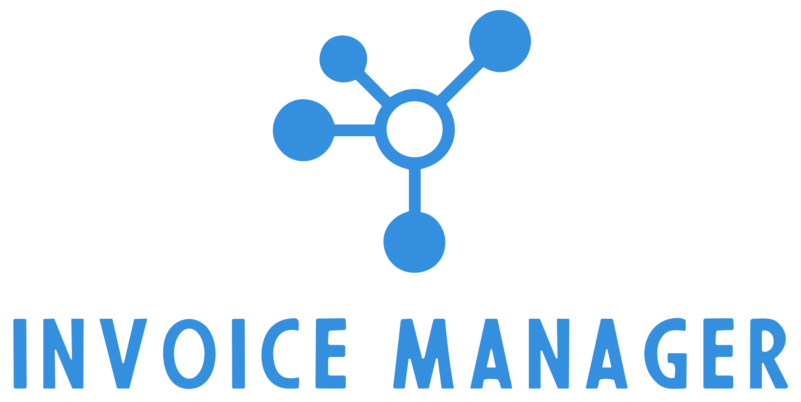
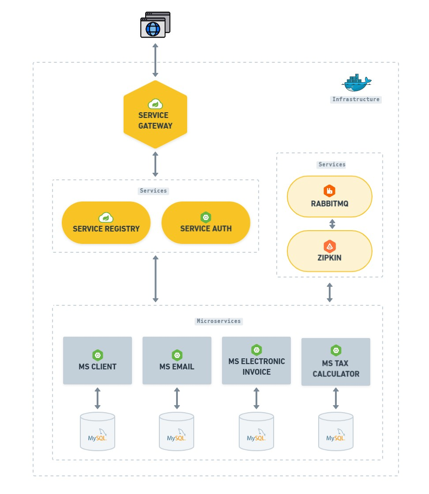

# Invoice Manager ️👨‍💻

<p align="center">
  
</p>

#


E uma aplicação de gerenciamento de notas fiscais que automatiza o cálculo de impostos. 
Ele permite aos usuários inserir informações das notas fiscais e automaticamente calcula os impostos aplicáveis.
Além disso, oferece recursos de armazenamento seguro das notas fiscais, geração de relatórios e conformidade fiscal, 
simplificando o processo de contabilidade e facilitando o cumprimento das obrigações tributárias.

**OBS:**
O intuito deste projeto é aplicar os conhecimentos de arquiteturas de microsserviços com Spring Cloud, visando criar um sistema escalável e resiliente que facilite o desenvolvimento, implantação e manutenção de serviços distribuídos na nuvem.

## Funcionalidades
- Gerenciamento de usuários
- Gerenciamento de empresas
- Gerenciamento de NF-e
- Cálculo de impostos
- Geração e download de relatórios

## Infraestrutura

É uma arquitetura de microsserviços que utiliza as ferramentas e bibliotecas do Spring Cloud para fornecer 
recursos essenciais, como descoberta de serviços, balanceamento de carga, gateway e monitoramento, 
facilitando o desenvolvimento e a implantação de aplicativos distribuídos na nuvem.

Todo o projeto foi organizado utilizando módulos do Maven, o que permitiu uma estruturação mais modular do código. 
Isso facilitou a manutenção e a compreensão do fluxo do projeto, além de permitir a reutilização de bibliotecas entre 
os módulos.

Na imagem abaixo é possível visualizar toda a organização da intraestrutura em containers dockers:

<p align="center">
  
</p>

### Serviços
| **Projeto**        | **Descrição**                                                                          |
|:-------------------|:---------------------------------------------------------------------------------------|
| _SERVICE GATEWAY_  | Ponto de entrada único para serviços de microsserviços, roteando solicitações.         |
| _SERVICE REGISTRY_ | Permite que os microsserviços se registrem e localizem automaticamente uns aos outros. |
| _SERVICE AUTH_     | Permite a validação de tokens JWT para autenticação do usuário entre os microserviços. |

### Microserviços
| **Projeto**               | **Descrição**                                                                                                                                                                |
|:----------------------|:-----------------------------------------------------------------------------------------------------------------------------------------------------------------------------|
| _MS CLIENT_             | Gerência as empresas e os gerentes, abrangendo a criação, atualização e exclusão, bem como a atribuição e gestão de gerentes associados a essas empresas.                    |
| _MS EMAIL_              | Gerência e envia e-mails de notificações para os usuários, fornecendo uma funcionalidade de comunicação direta e automatizada com os destinatários.                          |
| _MS ELECTRONIC INVOICE_ | Gerência as notas fiscais eletrônicas das empresas, incluindo a criação, armazenamento, recuperação e processamento.                                                         |
| _MS TAX CALCULATOR_     | É responsável por calcular e atribuir automaticamente os impostos fiscais nas notas fiscais registradas, garantindo conformidade tributária e precisão nos cálculos fiscais. |


## Principais tecnologias
- [Spring Boot](https://spring.io/projects/spring-boot): O Spring Boot é um framework de desenvolvimento em Java que 
simplifica a criação de aplicativos web e microserviços, fornecendo configuração e estrutura pré-definidas.
- [Spring Cloud](https://spring.io/projects/spring-cloud): O Spring Cloud é uma extensão do Spring Boot que oferece 
ferramentas para criar e gerenciar aplicativos distribuídos e sistemas de microsserviços na nuvem.
- [Spring Security](https://spring.io/projects/spring-security): é um módulo do Spring que fornece autenticação e 
controle de acesso para aplicativos Java, garantindo a segurança de recursos e endpoints.
- [Heteoas](https://spring.io/projects/spring-hateoas): Ajuda a criar APIs REST compatíveis com HATEOAS.
Ele simplifica a criação de links entre recursos em suas respostas.
- [Maven](https://maven.apache.org/): É uma ferramenta de automação de construção e gerenciamento de dependências 
usada principalmente em projetos Java. Ele simplifica o processo de compilação, empacotamento e distribuição de aplicativos.
- [MySQL](https://www.mysql.com/): É um sistema de gerenciamento de banco de dados relacional amplamente usado, 
conhecido por sua confiabilidade e desempenho, especialmente em aplicativos da web.
- [Docker](https://www.docker.com/): É uma plataforma de virtualização de contêineres que permite empacotar 
aplicativos e suas dependências em contêineres isolados.
- [Rabbitmq](https://www.rabbitmq.com/): É um sistema de mensageria de código aberto que facilita a comunicação entre
aplicativos distribuídos usando o modelo de filas de mensagens.
- [Zipkin](https://zipkin.io/): É uma ferramenta de rastreamento distribuído que ajuda a monitorar e depurar aplicativos
de microsserviços, permitindo rastrear o fluxo de solicitações e identificar gargalos de desempenho.
- [Swagger](https://swagger.io/): Simplifica a documentação e teste de APIs, permitindo aos desenvolvedores descrever,
visualizar e interagir com serviços da web de forma eficiente.
- [Resilience4j](https://resilience4j.readme.io/docs/getting-started): É uma biblioteca de tolerância a falhas. 
No projeto foram utilizados o Circuit Breaker que é um padrão de design que permite a falha rápida e evita 
chamadas a um serviço se ele estiver indisponível ou se houver uma alta taxa de erros. E o Rate Limiter que garante que um
cliente não exceda um número definido de solicitações por período de tempo.
- [Thymeleaf](https://www.thymeleaf.org/): É um mecanismo de template para processamento e criação de HTML, XML,
JavaScript, CSS e texto.
- [Flying Saucer PDF](https://github.com/flyingsaucerproject/flyingsaucer): Permite converter templates do thymeleaf em
arquivos PDF.

## Em breve

|   | Função                       |
|:--|:-----------------------------|
| ❌ | 100% de cobertura dos testes |

## Execução

1. Configure as variáveis de ambiente criando um arquivo com nome .env em cada microserviço. Na raiz de cada diretório, é possível encontrar 
o arquivo .env.exemple com os valores necessários.


2. Execute a construção das imagens Docker para os microserviços:
```bash
    mvn spring-boot:build-image -DskipTests
```

3. Aguarde até que todos os contêineres estejam online.


## Feedback

Se você tiver algum feedback, por favor nos deixe saber por meio de dev.igorpimentel@gmail.com

## Autores

- [@IgorPimentelG](https://www.github.com/IgorPimentelG)

